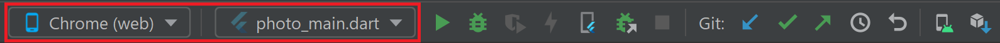
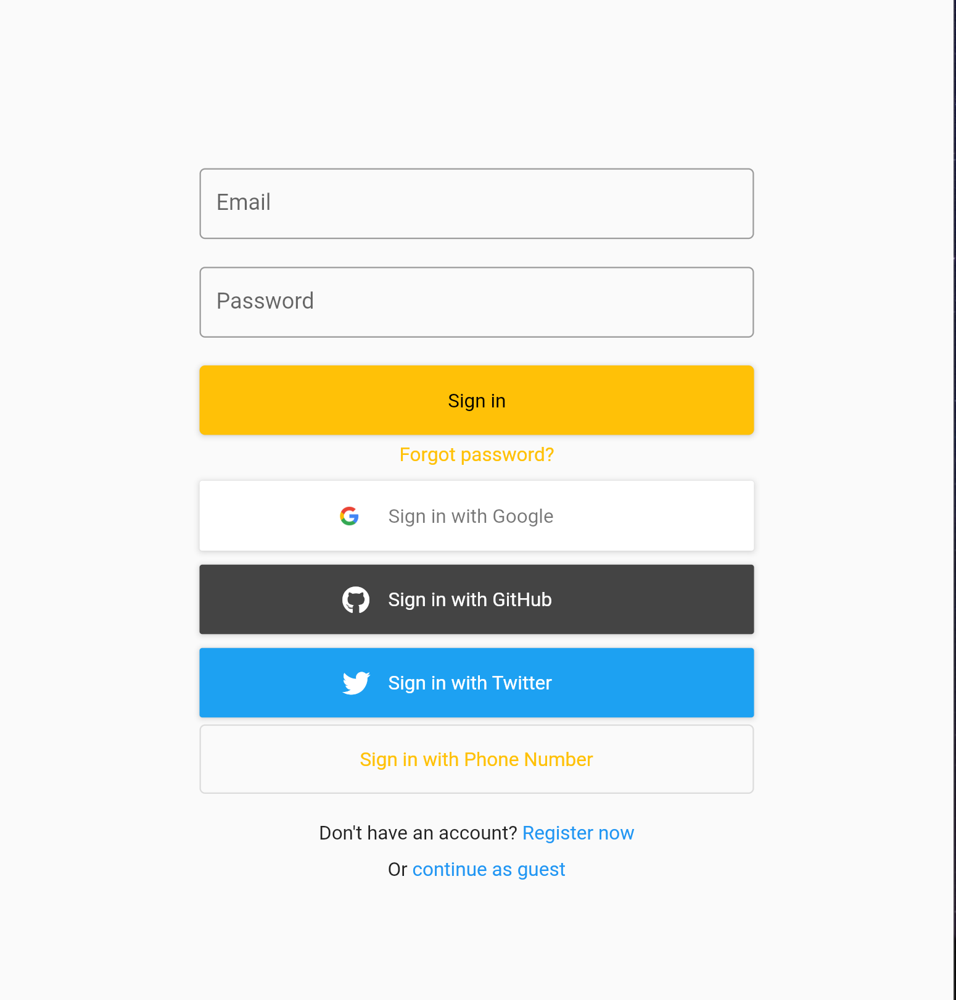

# my_family_story

My Family Story App

## Getting Started

This project is a starting point for a Flutter application.

A few resources to get you started if this is your first Flutter project:

- [Lab: Write your first Flutter app](https://flutter.dev/docs/get-started/codelab)
- [Cookbook: Useful Flutter samples](https://flutter.dev/docs/cookbook)

For help getting started with Flutter, view our
[online documentation](https://flutter.dev/docs), which offers tutorials,
samples, guidance on mobile development, and a full API reference.

# Build
Code generation is used in this project, we need to run build before compilation.  
```
# Run this if it's the first time you run it, or build failed because of missing packages
make clean_build
# Run this for normal workflow
make build
```

# Login 
Use Web to open and run this project




Login Firebase with registered account: *Username* -> tester1@test.com, *Password* -> 123123,



